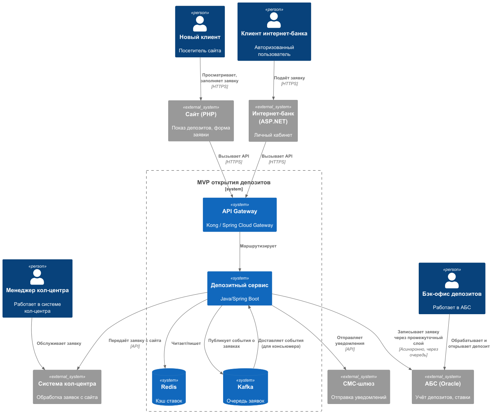
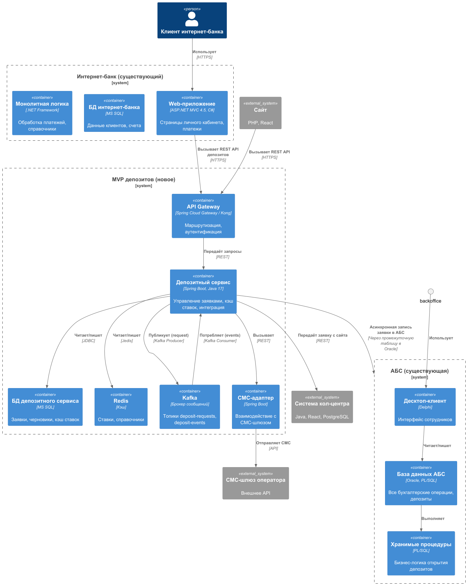

### **Название задачи:** Задание 3. Открытие депозитов онлайн
### **Автор:** Serminos
### **Дата:** 31.05.2026
### **Функциональные требования**
Опишите здесь верхнеуровневые Use Cases. Их нужно оформить в виде таблицы с пошаговым описанием:

| **№** | **Действующие лица или системы**       | **Use Case**                                    | **Описание**                                                                                |
|:-----:|:---------------------------------------|:------------------------------------------------|:--------------------------------------------------------------------------------------------|
| UC-1  | Новый клиент (неавторизованный)        | Просмотр депозитов на сайте                     | Клиент видит список доступных депозитов с актуальными ставками (из АБС или витрины)         |
| UC-2  | Новый клиент                           | Подача заявки на депозит с сайта                | Клиент вводит ФИО, телефон, сумму, срок. Данные передаются в систему кол-центра             |
| UC-3  | Менеджер кол-центра                    | Обработка заявки с сайта                        | Менеджер видит заявку в системе кол-центра, звонит клиенту, может предложить особые условия |
| UC-4  | Клиент интернет-банка (авторизованный) | Просмотр депозитов и персонализированных ставок | Клиент видит общие и индивидуальные ставки (рассчитанные на основе его данных)              |
| UC-5  | Клиент интернет-банка                  | Подача заявки на депозит                        | Выбирает счёт списания, сумму, подтверждает СМС-кодом. Заявка сохраняется                   |
| UC-6  | Менеджер бэк-офиса депозитов           | Обработка заявки в АБС                          | Открывает заявку, проверяет условия, подтверждает ставку, открывает депозит в АБС           |
| UC-7  | Система (СМС-шлюз)                     | Отправка уведомлений                            | Клиент получает СМС о подтверждении ставки и об открытии депозита                           |
| UC-8  | Сотрудник отделения                    | Продолжение работы с черновиком заявки          | Если клиент начал заявку онлайн, но не завершил, сотрудник видит черновик в АБС             |
### **Нефункциональные требования**
Опишите здесь нефункциональные требования и архитектурно значимые требования.

| **№** | **Требование**                                                                                                                  |
|:-----:|:--------------------------------------------------------------------------------------------------------------------------------|
|   1   | Загрузка списка депозитов и ставок – не более 1 сек (производительность)                                                        |
|   2   | Отклик интерфейса при подаче заявки – не более 1 с(производительность)                                                          |
|   3   | Доступность интернет-банка и сервиса депозитов – 99,9% (надёжность)                                                             |
|   4   | Автоматическое переключение на резервный ЦОД при сбое (без потери данных)                                                       |
|   5   | Прямая синхронная работа интернет-банка с АБС запрещена (ограничение)                                                           |
|   6   | Заявки не должны теряться – гарантированная доставка через очередь (надёжность)                                                 |
|   7   | Все коммуникации между клиентом и системами – шифрование TLS/HTTPS (безопасность)                                               |
|   8   | Использовать существующие технологии (MS SQL, Oracle, .NET/Java/PHP), Kafka – только для новых микросервисов (поддерживаемость) |
|   9   | Интернет-банк (ASP.NET MVC 4.5) несовместим с Kafka – требуется вынос нового функционала в отдельный микросервис (ограничение)  |
|  10   | Разграничение доступа к персональным данным по ролям (сотрудники кол-центра, отделения, бэк-офиса)                              |
### **Решение**
Приведите диаграммы контекста и контейнеров в модели C4. Опишите там основные компоненты и интеграции всех элементов решения. 
- [с4_context_diagram.puml](./с4_context_diagram.puml) — контекстная диаграмма (C4 L1)
- [c4_container_diagram.puml](./c4_container_diagram.puml) — диаграмма контейнеров (C4 L2), детализированы интернет-банк и АБС

#### Логика принятых решений
* Асинхронная обработка заявок – чтобы не нагружать АБС синхронными запросами (АБС перегружена и масштабируется только вертикально). Заявки передаются через Kafka, что обеспечивает гарантированную доставку и возможность повторной обработки.
* Выделенный микросервис «Депозитный сервис» – реализует бизнес-логику открытия депозитов, кэширование ставок, интеграцию с АБС и СМС-шлюзом. Позволяет обойти ограничение интернет-банка (ASP.NET MVC 4.5 не может работать с Kafka). Микросервис пишется на Java Spring Boot (в банке есть экспертиза Java-стека в команде АБС) или .NET Core (совместимость с существующим стеком, но требуется дообучение).
* API Gateway – единая точка входа для сайта и интернет-банка. Маршрутизирует запросы к Депозитному сервису, может выполнять аутентификацию и агрегацию.
* Отдельная база данных (MS SQL) для Депозитного сервиса – хранит заявки, временные черновики, кэш ставок. Используется для идемпотентности и связывания заявок из разных каналов.
* СМС-уведомления – через существующий СМС-шлюз (API телеком-оператора), без доработок подрядчика.
* Интеграция с АБС – через промежуточную таблицу в БД АБС (или через вызов хранимых процедур), но не напрямую из интернет-банка. Депозитный сервис записывает заявки в очередь на отправку в АБС; отдельный коннектор (лёгкий процесс) читает очередь и вызывает АБС.
* Ставки по депозитам – загружаются из Excel-файлов в БД Депозитного сервиса (и затем в АБС) через простой ETL-скрипт (Python или PowerShell). Это временное решение до полной автоматизации расчёта ставок в АБС.
* Кэширование – справочники и ставки кэшируются в Redis (или в памяти микросервиса) для обеспечения времени отклика <200 мс.
* Балансировка и отказоустойчивость – микросервис и API Gateway разворачиваются в Kubernetes (в двух ЦОД), что обеспечивает горизонтальное масштабирование и автоматическое переключение при сбоях.

### **Альтернативы**

| **№** | **Альтернатива**                                                                          | **Почему нет?**                                                                                                                                                 |
|:-----:|:------------------------------------------------------------------------------------------|:----------------------------------------------------------------------------------------------------------------------------------------------------------------|
|   1   | Прямой вызов АБС из интернет-банка через веб-сервисы                                      | АБС перегружена, не выдержит дополнительной нагрузки. Нарушает ограничение +R1.                                                                                 |
|   2   | Использование RabbitMQ вместо Kafka                                                       | Банк планирует использовать Kafka в перспективе (событийная архитектура). RabbitMQ потребовал бы ещё одной технологии без явных преимуществ                     |
|   3   | Модификация существующего интернет-банка (добавление логики открытия депозитов в монолит) | Интернет-банк на ASP.NET MVC 4.5 несовместим с Kafka, а без очереди невозможно обеспечить асинхронную передачу в АБС. К тому же монолит труднее масштабировать. |
|   4   | Размещение депозитного сервиса внутри АБС (как PL/SQL-пакеты)                             | Увеличит нагрузку на Oracle, не даст горизонтального масштабирования, потребует Delphi-разработчиков                                                            |

**Недостатки, ограничения, риски**

* Задержка при передаче заявки в АБС – асинхронная очередь (Kafka) и фоновый коннектор могут внести задержку в несколько секунд. Для MVP допустимо, но в целевом состоянии требуется автоматическое открытие (без бэк-офиса) – тогда задержка должна быть устранена.
* Ставки из Excel – пока не автоматизированы, возможны ошибки ручного ввода. План: в следующей итерации реализовать расчёт ставок в АБС или в отдельном сервисе.
* Отсутствие единого клиентского профиля – заявки с сайта и из интернет-банка связываются по номеру телефона, что может привести к дублям. Риск снижается за счёт идемпотентности и ручного связывания в отделении.
* Надёжность Kafka – требуется настройка кластера Kafka для отказоустойчивости, иначе потеря сообщений. В MVP можно использовать один узел, но с постоянным хранилищем.
* Интеграция с системой кол-центра – API кол-центра может быть не готов к приёму заявок в реальном времени. Нужно согласование с подрядчиком.
* Зависимость от времени отклика АБС – хотя мы не вызываем АБС синхронно, фоновый коннектор может столкнуться с блокировками в Oracle. Рекомендуется выполнять запись в АБС в периоды низкой нагрузки.
* Масштабирование API Gateway – при росте числа клиентов Gateway может стать узким местом. Использование горизонтального масштабирования (Kubernetes) и балансировщика нагрузки решит проблему.
* Безопасность – все API должны быть защищены TLS, а также необходима аутентификация запросов от интернет-банка и сайта (JWT или API-ключи). В описании не указано, но предполагается.

