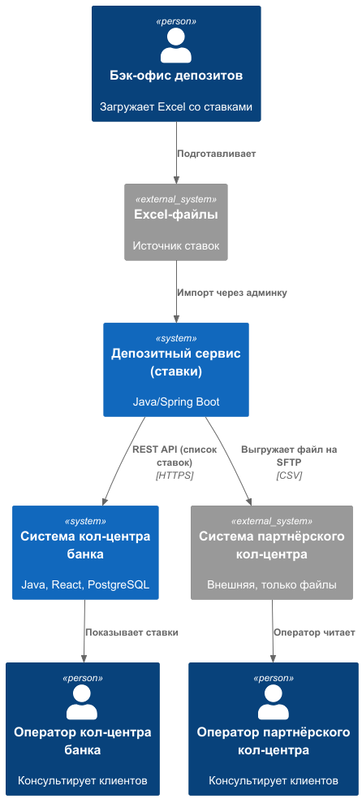
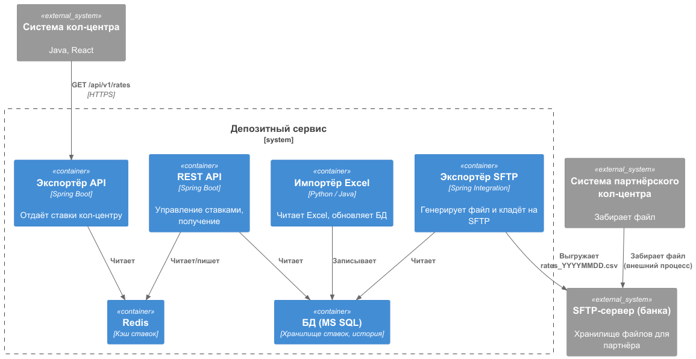
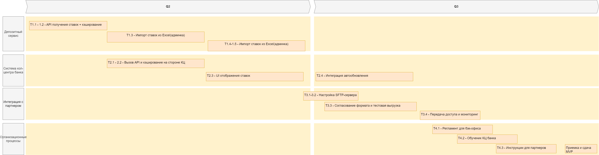

### **Название задачи:** Задание 4. Передача ставок в кол-центр
### **Автор:** Serminos
### **Дата:** 01.06.2026

### **Функциональные требования**
Опишите здесь верхнеуровневые Use Cases. Их нужно оформить в виде таблицы с пошаговым описанием:

| **№** | **Действующие лица или системы** | **Use Case**                         | **Описание**                                                                                             |
|:-----:|:---------------------------------|:-------------------------------------|:---------------------------------------------------------------------------------------------------------|
|   1   | Оператор кол-центра банка        | Просмотр текущих ставок по депозитам | Оператор в своей системе видит актуальные ставки (все продукты, без персонализации) для ответов клиентам |
|   2   | Оператор партнёрского кол-центра | Просмотр текущих ставок              | Партнёрский оператор получает актуальные ставки (в виде файла) и использует их по скрипту                |
|   3   | Система (депозитный сервис)      | Периодическая актуализация ставок    | Ставки загружаются из Excel-файлов (бэк-офис) в централизованное хранилище не реже 1 раза в день         |
|   4   | Система кол-центра банка         | Получение ставок через API           | Система кол-центра вызывает API депозитного сервиса для получения справочника ставок                     |
|   5   | Партнёрский кол-центр            | Получение файла ставок по SFTP       | Банк ежедневно выгружает файл (CSV/XML) на SFTP-сервер, партнёр забирает его                             |

### **Нефункциональные требования**
Опишите здесь нефункциональные требования и архитектурно значимые требования.

| **№** | **Требование**                                                                                                        |
|:-----:|:----------------------------------------------------------------------------------------------------------------------|
|   1   | Банк ежедневно выгружает файл (CSV/XML) на SFTP-сервер, партнёр забирает его                                          |
|   2   | API для получения ставок должно отвечать не более 200 мс (кэширование)                                                |
|   3   | Файл для партнёра должен генерироваться автоматически ежедневно в заданное время                                      |
|   4   | Передача файлов по SFTP должна быть защищена (шифрование, ключи)                                                      |
|   5   | Операции получения ставок не должны создавать избыточную нагрузку на АБС (данные берутся из кэша депозитного сервиса) |
|   6   | Система должна поддерживать ротацию файлов и логирование доставки                                                     |

### **Решение**
Приведите диаграммы контекста и контейнеров в модели C4. Опишите там основные компоненты и интеграции всех элементов решения.
- [с4_context_diagram.puml](./с4_context_diagram.puml) — контекстная диаграмма (C4 L1)
- [c4_container_diagram.puml](./c4_container_diagram.puml) — диаграмма контейнеров (C4 L2)

RoadMap (draw.io):

#### Логика принятых решений
* Централизация ставок в депозитном сервисе – уже спроектирован для MVP депозитов, имеет кэш (Redis) и БД. Добавляем возможность экспорта ставок. 
* API для системы кол-центра – система кол-центра имеет веб-интерфейс на React и бэкенд на Java, может вызывать REST API. Это простой и быстрый способ. 
* Файлы для партнёра – партнёр не поддерживает API, только файлы через SFTP. Это внешнее ограничение, принимаем как есть. 
* Автоматизация импорта из Excel – на первом этапе оставляем ручной импорт (бэк-офис загружает Excel через админку депозитного сервиса), в дальнейшем автоматизируем.

### **Альтернативы**

| **№** | **Альтернатива**                                          | **Почему нет?**                                                             |
|:-----:|:----------------------------------------------------------|:----------------------------------------------------------------------------|
|   1   | Прямой доступ системы кол-центра к БД депозитного сервиса | Увеличивает связанность, сложнее контролировать доступ и версионировать API |
|   2   | Отправка ставок в партнёрский кол-центр по email          | Нет гарантии доставки, сложно автоматизировать, небезопасно                 |
|   3   | Размещение ставок на веб-странице для партнёра            | Партнёр не может парсить; им нужен файл                                     |
|   4   | Использование общих таблиц в АБС для ставок               | АБС перегружена, не нужно её дополнительно нагружать                        |

**Недостатки, ограничения, риски**
* Ручной импорт Excel – остаётся человеческий фактор (ошибки, забыли загрузить). Для MVP допустимо, но в целевой архитектуре необходимо автоматизировать.
* Задержка обновления ставок – до 1 часа (из-за расписания экспорта для партнёра). Для консультаций кол-центра это приемлемо.
* Отсутствие обратной связи от партнёра – банк не знает, успешно ли партнёр забрал файл. Риск использования устаревших данных. Можно добавить механизм подтверждения (партнёр вызывает отдельный API, но не предусмотрено). Компенсация – регулярные сверки и рекламации.
* Безопасность SFTP – необходимо настроить доступ по ключам, ограничить IP, использовать сильные пароли. Риск компрометации.
* Нагрузка на депозитный сервис – при частых запросах от кол-центра. Решается кэшированием и ограничением частоты.
* Зависимость от Excel-формата – бэк-офис может изменить шаблон, что сломает импорт. Нужна строгая спецификация и валидация.

### **Список крупных задач**
1. Депозитный сервис (уже создаётся в Task3)
   1. Реализовать REST API для получения списка ставок
   2. Внедрить кэширование ставок в Redis
   3. Разработать модуль импорта ставок из Excel
   4. Разработать модуль экспорта ставок в CSV для партнёрского кол-центра
   5. Настроить SFTP-клиент для выгрузки CSV-файла на внешний SFTP-сервер
2. Система кол-центра банка (существующая, доработка)
   1. Добавить в бэкенд (Java Spring) вызов API депозитного сервиса для получения ставок
   2. Реализовать кэширование на стороне кол-центра (чтобы не дёргать API при каждом запросе оператора)
   3. Разработать UI-компонент (React) для отображения списка ставок
   4. Интегрировать обновление данных (по кнопке или автоматически каждые 5 минут)
3. Инфраструктура / Интеграция с партнёрским кол-центром
   1. Поднять SFTP-сервер в сети банка
   2. Создать отдельного пользователя для партнёра, настроить права доступа только на каталог выгрузки
   3. Согласовать с партнёром(формат CSV, расписание выгрузки, механизм оповещения об ошибках)
   4. Предоставить партнёру SSH-ключ и инструкцию по подключению
4. Процессы и обучение
   1. Разработать регламент для бэк-офиса депозитов по подготовке и загрузке Excel-файла со ставками
   2. Провести обучение операторов кол-центра банка работе с новым UI ставок
   3. Провести обучение (или предоставить инструкцию) для партнёрского кол-центра по использованию CSV-файла в скриптах