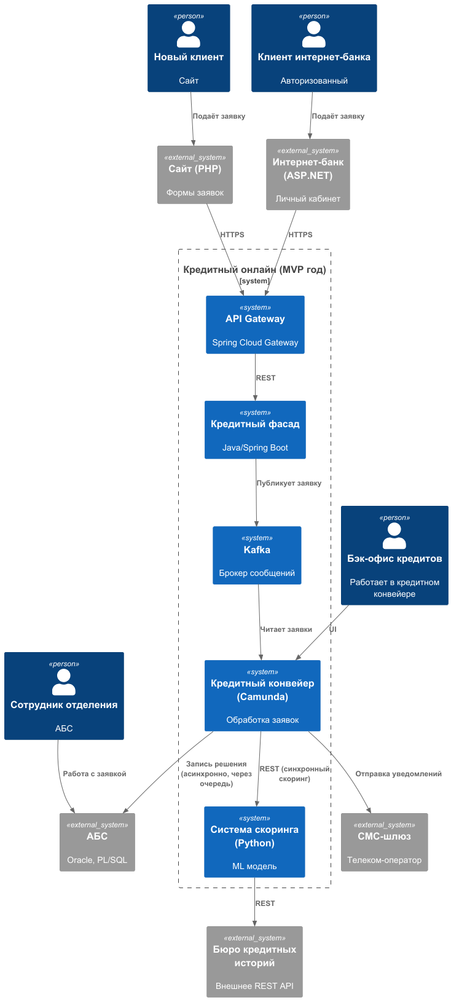
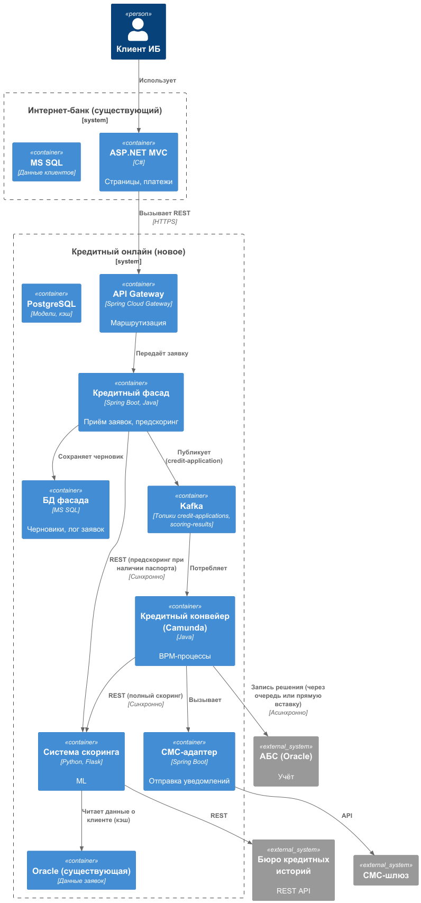

### **Название задачи:** Задание 5. Заявка на кредит онлайн
### **Автор:** Serminos
### **Дата:** 01.06.2026
### **Функциональные требования**
Опишите здесь верхнеуровневые Use Cases. Их нужно оформить в виде таблицы с пошаговым описанием:

| **№** | **Действующие лица или системы**       | **Use Case**                                         | **Описание**                                                                                                                                                                                                              |
|:-----:|:---------------------------------------|:-----------------------------------------------------|:--------------------------------------------------------------------------------------------------------------------------------------------------------------------------------------------------------------------------|
| UC-1  | Новый клиент (неавторизованный)        | Просмотр кредитных предложений на сайте              | Видит базовые условия кредитов, получаемые из кредитного конвейера                                                                                                                                                        |
| UC-2  | Новый клиент                           | Подача заявки на кредит с сайта                      | Вводит ФИО, телефон, паспортные данные (опционально). Если паспортные данные указаны – система сразу запрашивает скоринг (через БКИ) и возвращает предварительное решение. Клиент получает СМС с приглашением в отделение |
| UC-3  | Клиент интернет-банка (авторизованный) | Просмотр предодобренных предложений                  | Видит персонализированные условия (сумма, ставка) на основе периодического скоринга                                                                                                                                       |
| UC-4  | Клиент интернет-банка                  | Подача заявки на кредит (обычный или предодобренный) | Выбирает счёт зачисления, подтверждает СМС. Заявка передаётся в кредитный конвейер онлайн                                                                                                                                 |
| UC-5  | Система (кредитный конвейер)           | Обработка заявки в реальном времени                  | При получении заявки из интернет-банка вызывает скоринг (онлайн), данные берутся из БКИ + АБС (кэш). Результат передаётся бэк-офису.                                                                                      |
| UC-6  | Бэк-офис кредитов                      | Обработка предодобренных заявок                      | В течение того же рабочего дня принимает решение (автоматически или вручную)                                                                                                                                              |
| UC-7  | Система                                | Отправка СМС об изменении статуса заявки             | Клиент получает уведомления на каждом этапе                                                                                                                                                                               |
| UC-8  | Сотрудник отделения                    | Продолжение работы с онлайн-заявкой                  | Видит уже поданную заявку в АБС, может продолжить оформление (идентификация, договор)                                                                                                                                     |
### **Нефункциональные требования**
Опишите здесь нефункциональные требования и архитектурно значимые требования.

| **№** | **Требование**                                                                                                               |
|:-----:|:-----------------------------------------------------------------------------------------------------------------------------|
|   1   | Передача заявки из интернет-банка в кредитный конвейер должна происходить онлайн (не раз в сутки)                            |
|   2   | Время получения предварительного скоринга для клиента с паспортными данными – не более 5 секунд                              |
|   3   | Система скоринга не должна перегружаться предрасчётами в часы пик – предодобренные офферы рассчитываются асинхронно (ночью)  |
|   4   | АБС не должна вызываться синхронно из интернет-банка – использовать очередь сообщений (Kafka) для записи заявок              |
|   5   | Доступность сервиса подачи заявок – 99,9% (круглосуточно)                                                                    |
|   6   | Все коммуникации шифруются TLS/HTTPS                                                                                         |
|   7   | Использовать существующие технологии: Java (конвейер, скоринг), Python (скоринг), .NET (интернет-банк), Kafka – для очередей |
|   8   | Интернет-банк (ASP.NET MVC 4.5) несовместим с Kafka – вынести логику подачи заявок в отдельный микросервис                   |
|   9   | Заявки не должны теряться – гарантия доставки через Kafka с persistent storage                                               |
### **Решение**
Приведите диаграммы контекста и контейнеров в модели C4. Опишите там основные компоненты и интеграции всех элементов решения. 
- [с4_context_diagram.puml](./с4_context_diagram.puml) — контекстная диаграмма (C4 L1)
- [c4_container_diagram.puml](./c4_container_diagram.puml) — диаграмма контейнеров (C4 L2), детализированы интернет-банк и АБС

#### Логика принятых решений
* Микросервис "Кредитный фасад" – выносим логику приёма заявок из интернет-банка, так как текущий ASP.NET MVC 4.5 не может работать с Kafka. Этот сервис (на Java Spring Boot) будет принимать REST-запросы от интернет-банка и сайта, публиковать их в Kafka, а также вызывать скоринг для предварительных решений (для сайта).
* Кредитный конвейер (Camunda) – остаётся, но теперь он не ждёт суточной выгрузки из АБС, а читает топик Kafka с новыми заявками. Это позволяет обрабатывать заявки онлайн.
* Система скоринга – расширяем API для приёма синхронных запросов от кредитного фасада (по паспортным данным, для предварительного решения). Для предодобренных офферов оставляем асинхронный ночной расчёт (через тот же скоринг).
* АБС – не трогаем; зачисление средств после одобрения остаётся через пакетную выгрузку из конвейера (или можно сделать отдельный микросервис для записи в АБС через очередь). В целевом состоянии планируем автоматическое зачисление через API-адаптер.
* API Gateway – единая точка входа для сайта и интернет-банка, маршрутизация на кредитный фасад.

Kafka – центральная шина для всех событий: credit-application-events, scoring-requests, scoring-results.

### **Альтернативы**

| **№** | **Альтернатива**                                                                | **Почему нет?**                                                                                      |
|:-----:|:--------------------------------------------------------------------------------|:-----------------------------------------------------------------------------------------------------|
|   1   | Модифицировать существующий интернет-банк, добавив прямую запись в БД конвейера | Нарушает безопасность (прямой доступ к БД), сложно синхронизировать, интернет-банк не масштабируется |
|   2   | Использование RabbitMQ вместо Kafka                                             | Банк уже планирует Kafka для событийной архитектуры; RabbitMQ добавит ещё одну технологию            |
|   3   | Синхронный вызов АБС для зачисления                                             | АБС не выдержит нагрузки; запрещено архитектурным ограничением                                       |
|   4   | Оставить пакетную выгрузку раз в сутки                                          | Не позволяет получить решение в течение дня; требование бизнеса                                      |

**Недостатки, ограничения, риски**

* Задержка передачи заявки через Kafka – в пиковых нагрузках возможна задержка в несколько секунд, но для кредитного процесса допустимо. 
* Скоринг для предодобренных предложений остаётся асинхронным – клиент видит оффер, рассчитанный прошлой ночью, что может не учитывать свежие изменения (например, просрочку). Компенсация – при подаче заявки выполняется повторный скоринг. 
* Необходимость выноса кредитного фасада – требует создания нового микросервиса и его поддержки (дополнительные ресурсы). 
* Интеграция с бюро кредитных историй может быть медленной – внешний API. Необходим таймаут и fallback (например, предварительное решение без БКИ). 
* АБС остаётся узким местом для зачисления – пока зачисление выполняется пакетно. В целевом состоянии нужно реализовать API-адаптер к АБС с очередью. 
* Сложность отладки распределённой транзакции – необходимо реализовать идемпотентность и сагу (например, через Kafka с dead letter queue). 
* Безопасность – все API должны быть защищены JWT-токенами, также требуется валидация входных данных.

